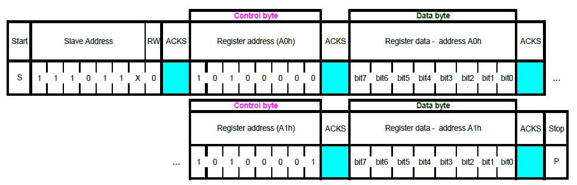
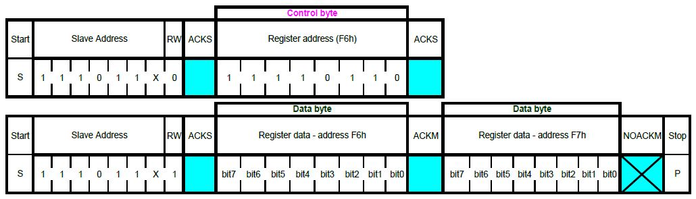
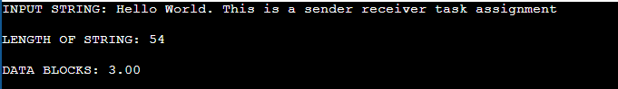
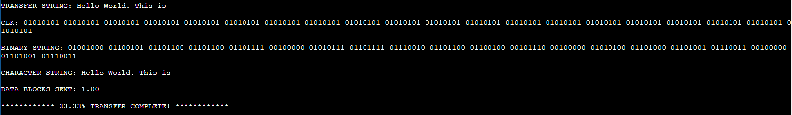
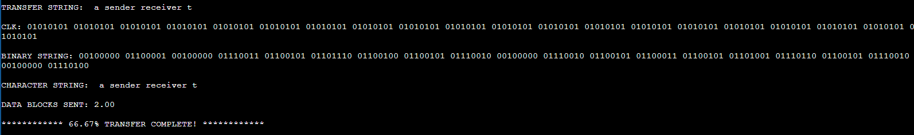
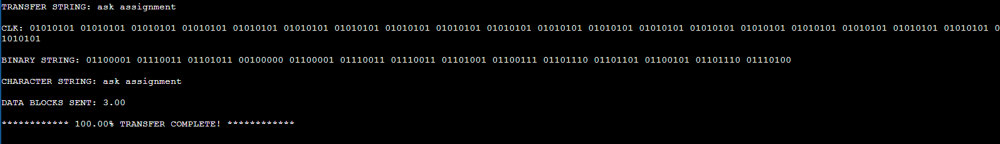

# Data-Transfer-Assignment
## This project is an implementation of an approach to transfer data to-and-fro between two devices where a third device monitors the transmission and reception between them.

### Approach Used

#### Steps for Transmission of data

1. First I calculate the input string length.
2. Then I calculate the number of data blocks each with a size of 20 bytes
3. The string with a size of 20 bytes is sent to the transmit function along with total number of data blocks.
4. The loop runs till all the blocks are sent.

#### Steps for Reception of data

1. The complete binary string is sent as input to the receive function.
2. Then I use string delimiter functions from standard C library files to breakdown the binary string into 8-bit/ 1 character long strings.
3. Then I convert each character from its binary format to character format.
4. Using a pointer to a character array, I store all these characters to form a complete string (20 byte long).

#### Digital Transfer Protocol

In case if we use the I2C protocol, we first send the 8-bit device address that includes the read/write bit. For write operations, the bit is set to 0 while for read operations, the bit is set to 1.

I2C Write

1. The write operation is a single step process where device address in write mode is sent.

2. Then the memory location address along with the data to be written to that location.

I2C Read

1. The read operation is a two step process where first the device address in write mode is sent along with the memory location address to read from.

2. Then the device address is sent in read mode along with the number of bytes to receive from the device/slave.

### Results

1. First result shows the input string

2. Second result shows the first 20 bytes sent along with the percentage progress completed

3. Third result shows the next 20 bytes sent along with the percentage progress completed.

4. Final result shows the last 20 bytes sent along with the percentage progress completed

